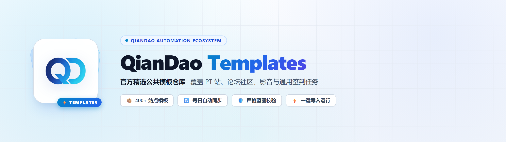

<picture>
  <source media="(prefers-color-scheme: dark)" srcset="brand/qiandao-templates-banner-dark.png">
  
</picture>

# QianDao Templates

「QianDao 自动化运行台」的公共模板仓库。这里的模板由上游社区仓库`qd-today/templates` **自动同步并按站点类型整理**后发布，供 [QianDao](https://github.com/co11ector/QianDao)的用户一键创建定时签到任务。

## 模板数量

- `pt/` — PT 站（18）
- `forum/` — 论坛社区（68）
- `video/` — 影音（8）
- `signin/` — 通用签到（308）

## 目录结构

```
templates/<分类>/<模板文件>.har
tpls_history.json      # 索引；filename 为相对路径，应用按 <仓库地址>/<filename> 抓取
tools/normalize.py     # 整理脚本（同步流水线调用）
CATEGORIES.md          # 分类规则
```

## 自动同步

`.github/workflows/sync-upstream.yml` 每天 03:17 UTC（北京时间 11:17）自动执行：
拉取上游 → 校验每个 HAR 可读 → 按关键词分类摆放 → 重新生成索引 → 提交推送。
上游一有更新，本仓库会在 24 小时内跟上，无需人工干预。

## 在 QianDao 中使用

应用内「模板库 → 公共模板」默认订阅本仓库；也可以在「已注册仓库」里手动添加：
仓库地址 `https://github.com/co11ector/QianDao-Templates`，分支 `master`。

## 许可与来源

- 模板**数据**镜像自上游仓库 [qd-today/templates](https://github.com/qd-today/templates)，该仓库未声明许可证，其 README 注明「项目中的模板均为开源模板，仅供学习参考使用，请勿用于商业用途」。本仓库按同样口径向个人用户提供学习参考，请勿商用。
- 每个模板的**作者与出处**记录在 `tpls_history.json` 的 `author`、`comments` 与 `commenturl` 字段，权利归原作者所有；如原作者要求移除其模板，请提 issue，我们会处理。
- 本仓库中的整理脚本 `tools/normalize.py` 来自 [QianDao](https://github.com/co11ector/QianDao)（MIT License，Copyright © 2021 QD-Today、2026 co11ector），与模板数据分属不同的授权范围。

如发现某个模板违反你的权利或站点规则，请提 issue 说明，我们会尽快移除。
